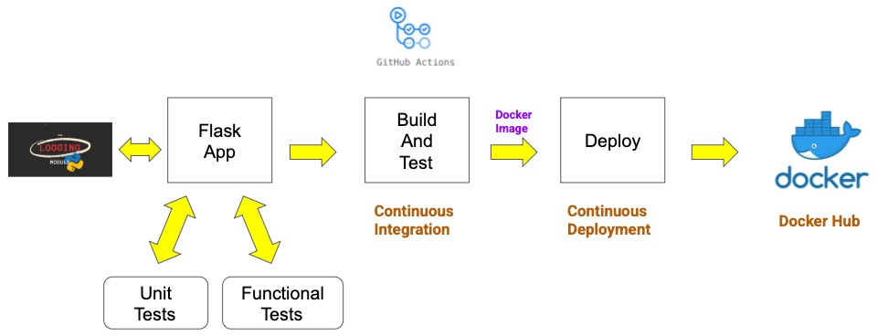
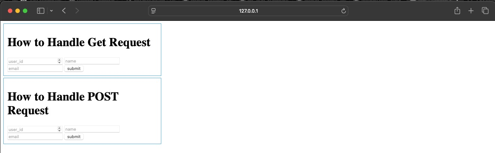

# Demo UV Application - An Example for How to Build Smart Python Projects Using UV.

<div align="center">
    
</div>

<br>


[](https://github.com/beenlanced/python_project_uv_flask_webapp_demo/actions/workflows/flask_app_test.yml)

---

## Project Description

This is a web application built using Python and Flask. I know, I know, `Y`et `A`nother `F`lask `A`pplication (`YAFA`). But wait, there is more here than meets the eye with this project. It's an end-to-end Continuous Integration / Continuous Deployment (CI/CD) project constructed using the `uv` package manager. While the web application is simple, the complexity of the project structure and its contents are the real payoff. If you have been asking, "Where can I find a single project that exemplifies proper structure, shows me how to use `uv`, runs unit and functional tests, builds log files, and instructs me on how to perform continuous integration and deployment of code updates (here as docker images)? Then, this endeavor is for you.

---

## Objective

The project uses the well-known `source (SRC)` layout structure. It contains the key elements:

- `CI/CD` automated pipeline created using `GitHub Actions`,
- `Docker`. Application code is containerized so it can be deployed just as easily to a user's host machine or to the cloud. It uses a Dockerfile which that employs a multi-stage docker build using `uv`,
- `Custom Exceptions` for when you want to create your own unique error messages,
- `Environment` variable usage,
- `Functional tests` and `unit tests` using `pytest`,
- `Git` (version control),
- `Github` with a pull request template like you might use at work,
- `Logging` using Python's logging module , `dictConfig` with `JSON` configuration file, and custom `JSONformatter` class,
- `Type` hinting using `mypy` and `Pylance`,
- `Web application` using `Flask`, and
- `uv` package management including use of `ruff` for linting and formatting.

New to uv and not sure how to construct a docker file with it. Hoping to understand some Github action set-ups. Wanting to see how all the parts fit together for an end-to-end project. Curious about Python logginging. Or just need a project structure that can be used to boot strap future projects--this repo has got you covered.

It is a learning tool for the seasoned professional, student, or hobbyist.

---

## Tech Stack


---

## Project Structure

```
.
|
├── compose.yml
├── configs
│   ├── app_config.py
│   └── logging_configs
│       ├── logger_configure.json
│       ├── mylogger.py
│       └── setup_logging.py
├── data
│   └── raw.csv
├── Dockerfile
├── exceptions
│   └── custom_exceptions.py
|── imgs
├── LICENSE
├── logs
│   └── flask_app_log.jsonl
├── pyproject.toml
├── README.md
├── src
│   ├── app.py
│   ├── get_data.py
│   ├── home_page
│   │   └── routes.py
│   ├── posts
│   │   └── routes.py
│   ├── requests
│   │   └── routes.py
│   └── templates
│       ├── get_post.html
│       └── home.html
├── tests
│   ├── functional
│   │   ├── conftest.py
│   │   ├── READMD.md
│   │   ├── test_home.py
│   │   ├── test_posts.py
│   │   └── test_requests.py
│   └── unit
│       ├── READMD.md
│       ├── test_data
│       │   ├── empty.csv
│       │   └── non_empty.csv
│       └── test_get_data.py
└── uv.lock
```

---

## Getting Started

Here are some instructions to help you set up this project locally.

---

## Installation Steps

### Option 1: Installation from Github with UV (recommended)

Here are the steps to install and set up a Github repository as a package/project directly from a `GitHub` repository using `uv`:

1. **Install uv**

   - If you haven't already, install uv. Several installation methods are available, including using a standalone installer or installing from PyPI with pipx or pip.

     - Using the standalone installer (example for macOS/Linux)

       ` curl -fsSL https://astral.sh/uv/install.sh | s`

   - Install from GitHub: Use `uv pip install` with the GitHub repository URL. The format is.

     `uv pip install git+https://github.com//<repo>.git`

   - To install a specific branch, tag, or commit, add `@<reference>` to the URL.

`uv pip install git+https://github.com/beenlanced/python_project_uv_flask_webapp_demo.git@<branch_name>`

- Editable installs: For local development where you want changes in the repository to be immediately reflected, use the `-e` flag.

`uv pip install -e git+https://github.com/beenlanced/python_project_uv_flask_webapp_demo.git`

- Specifying dependencies in pyproject.toml: You can also add the GitHub repository as a dependency in your pyproject.toml file.

  [tool.poetry.dependencies]
  your_package = { git = "https://github.com/beenlanced/python_project_uv_flask_webapp_demo.git", rev = "<branch/tag/commit>" } # For Poetry

  [project.dependencies]
  your_package = { git = "https://github.com/beenlanced/python_project_uv_flask_webapp_demo.git", ref = "<branch/tag/commit>" } # For setuptools/build

2. **Install Dependencies- with `uv` it is already done for you**

   - All dependencies should be specified in the **pyproject.toml** file, so you should not have to add any additional dependencies.
   - To update your projects virtual environment simply run  
      `uv pip sync`
     This will also activate your virtual environment (e.g., .venv folder) without requiring manual activation of the environment on your part with all the required packages as specified in the **pyproject.toml** file.

3. **Run the Project**

   - Start the project by running the appropriate command at the root directory
     ```
     uv run flask_app
     ```
     or
     ```
     uv run src/app.py
     ```

4. **Access the Project's Web Interface **
   - Open a web browser with following url.
     - http://127.0.0.1:5001
       - I use port TCP 5001 to avoid potential collisions with other applications that might use port 5000 which is the typical port that Flask uses.

- This web app uses GET and POST requests for a simple static webpage shown below.

<div align="center">
    
</div>

- This application has a single database which is really a Python dictionary with one entry (below) that we use to test against the GET and POST sections of the application. Pretty, simple web application overall.

  - {"user_id": 100, "name": "john doe", "email": "john.doe@email.com"}

- To test in the `Get` section

```
  Via GUI Interface (http://127.0.0.1:5001/) enter the following values for each field in the Get Section to obtain the result shown:
        >>> user_id: 100
        >>> name: john doe
        >>> email: john.doe@example.com
       Result:  Sorry, User already Exists.

        Via GUI Interface (http://127.0.0.1:5001/) enter the following values for each field :
        >>> user_id: 200
        >>> name: jane doe
        >>> email: jane.doe@example.com
        Result: Email is available. Welcome New User!
```

### Option 2: Installation from DockerHub

If you prefer to use Docker, you can install and run the project using a Docker container from an image from my DockerHub:

1. **Pull the Docker Image**

   - Open your terminal or command prompt.
   - Run the following command to pull the Docker image from DockerHub:
     ```
     docker pull ubeenlanced/demo_uv_app
     ```

2. **Run the Docker Container**

   - Start the Docker container by running the following command. Adjust the port mapping as needed:
     ```
     docker run -p 5001:5001 --name <your container name (e.g., flask_app)> <docker image id>
     ```
     This command launches the project within a Docker container.

3. **Access the Project**
   - Open a web browser or the appropriate client to access the project.
     - http://127.0.0.1:5001
       - I use port TCP 5001 to avoid potential collisions with other applications that might use port 5000 which is the typical port that Flask uses. (see comments above for testing or view docstrings in the source code)

---

## Review the Source Code

Have a look at the various directories, modules, and other files for examples of how to perform logging, testing, set up Dockerfiles, etc.
The project is full of insights.

---

### Final Words

Thanks for visiting.

Give the project a star (⭐) if you liked it or if it was helpful to you!

You've `beenlanced`! 😉

---

## Acknowledgements

I would like to extend my gratitude to all the individuals and organizations who helped in the development and success of this project. Your support, whether through contributions, inspiration, or encouragement, have been invaluable. Thank you.

Specifically, I would like to acknowledge:

- [Hema Kalyan Murapaka](https://www.linkedin.com/in/hemakalyan) and [Benito Martin](https://martindatasol.com/blog) for sharing their README.md templates upon which I have derieved my README.md.

- The folks at Astral for their UV [documentation](https://docs.astral.sh/uv/)

---

## License

This project is licensed under the MIT License - see the [LICENSE](./LICENSE) file for details
